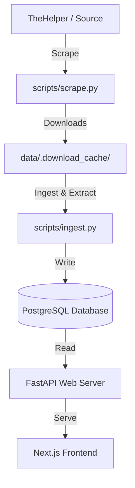

# ExamScope Data Pipeline

The ExamScope architecture strictly decouples data discovery and ingestion from the public web application. This ensures that the production FastAPI application remains fast and secure, merely serving statically extracted and validated relationships from the PostgreSQL database, rather than dynamically parsing PDFs or interacting with scraper endpoints.

## Architecture



## CLI Commands

The pipeline requires explicit execution by the administrator in isolated worker environments.

### 1. Scrape

The scraper discovers and downloads raw PDFs to the local cache. It prevents duplicates and handles network failures gracefully.

```bash
python scripts/scrape.py
```

### 2. Ingest

The ingestion worker parses local PDFs, extracts structural evidence (questions, concepts, sections), and persists them idempotently into the database schema. Running it multiple times on the same cache produces the exact same database state.

```bash
python scripts/ingest.py
```

### 3. Analyze

The analysis engine precomputes DNA structures, calculates temporal distributions, identifies families, and aggregates marks patterns.

```bash
python scripts/analyze.py
```

### 4. Backtest

The backtester validates predictive accuracy by holding out historical years (e.g., hiding 2023 data) and testing whether the DNA correctly projected the 2023 topic distribution.

```bash
python scripts/backtest.py
```

## Production Guidelines

- **NEVER** run scraping logic in a web request handler.
- **NEVER** download PDFs in the public API.
- **NEVER** run LLM extraction (Knowledge/Question) synchronously during a user API call.
- The pipeline commands should be run as cron jobs or manual operations in a secured backend environment.
